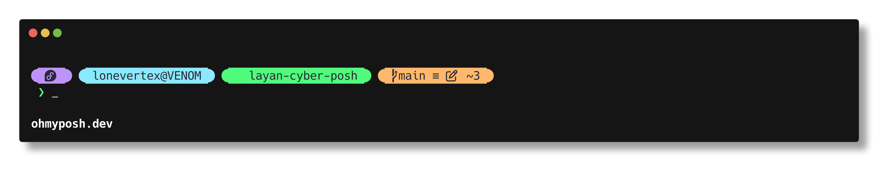

<div align="center">

# ⚡ layan-cyber

### A sleek, modern Cyberpunk & Dracula-inspired capsule theme for [Oh My Posh](https://ohmyposh.dev)

[](LICENSE)
[](https://github.com/LoneVertex/layan-cyber-posh/actions/workflows/validate.yml)
[](https://github.com/LoneVertex/layan-cyber-posh/releases)
[](https://ohmyposh.dev)
[]()

<br>

<p align="center">
  
</p>

</div>

---

## ✨ Features

- 💊 **Floating Capsule Geometry:** Clean rounded Powerline pill caps (`` / ``) creating separate floating segments rather than connected sharp chevrons.
- 🎨 **Cyberpunk × Dracula Palette:** Carefully balanced palette using deep slate charcoal (`#282a36`), off-white (`#f8f8f2`), and neon pastels (cyan, purple, lime green, yellow, orange, coral red). Fully WCAG AA contrast compliant.
- 🧭 **Two-Line Responsive Layout:**
  - **Upper line:** System details, active directory, git status, and right-aligned runtime versions.
  - **Lower line:** Error exit code indicator (`✗ <code>`) and clean prompt arrow (` ❯ `), giving you maximum horizontal room for long commands.
- ⚡ **Precise Git Status Color Matrix:**
  | Git State | Background |
  |---|---|
  | Unresolved merge conflict | 🔴 Red (`Working.Unmerged > 0`) |
  | Diverged (ahead + behind) | 🔴 Red |
  | Dirty (uncommitted changes) | 🟠 Orange |
  | Behind upstream | 🟠 Orange |
  | Ahead of upstream (clean) | 🟣 Purple |
  | Clean / no remote | 🟡 Yellow |
  - Branch name, ahead/behind counts, working tree changes (``), staged file counts (``), and stash counter (``).
  - Results cached — sub-millisecond git lookups after first render.
- 🖥️ **SSH Session Indicator:** The session pill shows `󰢹` when connected over SSH, giving instant visual context on remote machines.
- 🚀 **Polyglot Developer Tooling (Right Prompt, hidden on narrow terminals):**
  - **Node.js (``):** Activates automatically when `package.json` or JS/TS files exist.
  - **Go (``):** Activates automatically when `go.mod` exists.
  - **Rust (``):** Activates automatically when `Cargo.toml` exists.
  - **Python (``):** Displays virtual environment name when active.
  - **Execution Timer (`󱎫`):** Displays command duration when execution exceeds 2000ms.
- 🪄 **Transient Prompt:** Collapses previous prompts into a minimalist ` ❯ ` on Enter, keeping terminal scrollback clean. Primary line 2 and transient prompt are perfectly column-aligned — zero cursor jitter.
- 📦 **Multi-Format:** Provided in **TOML** (canonical), **JSON**, and **YAML** — all three kept 100% in lockstep and schema-validated in CI.

---

## 🎨 Color Palette

| Token | Hex | Role / Segment |
|---|---|---|
| `dark` | `#282a36` | Segment text & primary contrast foreground |
| `light` | `#f8f8f2` | Base light text |
| `purple` | `#bd93f9` | OS Distro pill & Git ahead state |
| `cyan` | `#8be9fd` | User & host session pill & Go runtime |
| `green` | `#50fa7b` | Current directory path pill, Node runtime & prompt pointer |
| `yellow` | `#f1fa8c` | Clean Git state, Python venv & execution time pill |
| `orange` | `#ffb86c` | Dirty / behind Git status & Rust runtime |
| `red` | `#ff5555` | Root session, diverged Git state & non-zero exit codes |
| `grey` | `#44475a` | Language runtime segment backgrounds |
| `pink` | `#ff79c6` | Accent highlights |

---

## 📋 Prerequisites

1. **[Oh My Posh](https://ohmyposh.dev/docs/installation)** (v3 or later):
   ```bash
   # Linux / macOS (Homebrew or binary installer)
   curl -s https://ohmyposh.dev/install.sh | bash -s
   ```
2. **A [Nerd Font v3+](https://www.nerdfonts.com/)** installed and configured in your terminal emulator.  
   **Version 3 is required** — the theme uses `󰢹` (SSH indicator), `` (stash), and modern runtime glyphs.  
   Recommended: *JetBrainsMono Nerd Font*, *FiraCode Nerd Font*, *MesloLGS NF*, or *Cascadia Code NF*.

---

## 📥 Installation

### Option 1: Quick Install Script (Recommended)

Run the remote installer directly:

```bash
curl -fsSL https://raw.githubusercontent.com/LoneVertex/layan-cyber-posh/main/install.sh | sh
```

The installer also supports flags when run locally or saved:
```bash
./install.sh --help         # Show options
./install.sh --dir /path    # Install to custom directory
./install.sh --uninstall    # Remove installed theme files
```

### Option 2: Direct URL (No Local Files Needed)

You can load the theme directly from GitHub without downloading or cloning:

```bash
eval "$(oh-my-posh init bash --config https://raw.githubusercontent.com/LoneVertex/layan-cyber-posh/main/themes/layan-cyber.omp.toml)"
```

### Option 3: Manual Clone

```bash
git clone https://github.com/LoneVertex/layan-cyber-posh.git
cd layan-cyber-posh
./install.sh
```

---

## ⚙️ Shell Configuration

Add the initialization line to your respective shell configuration file:

### Bash (`~/.bashrc`)
```bash
if command -v oh-my-posh >/dev/null 2>&1; then
    eval "$(oh-my-posh init bash --config "$HOME/.config/oh-my-posh/themes/layan-cyber.omp.toml")"
fi
```

### Zsh (`~/.zshrc`)
```zsh
if (( $+commands[oh-my-posh] )); then
    eval "$(oh-my-posh init zsh --config "$HOME/.config/oh-my-posh/themes/layan-cyber.omp.toml")"
fi
```

### Fish (`~/.config/fish/config.fish`)
```fish
if type -q oh-my-posh
    oh-my-posh init fish --config "$HOME/.config/oh-my-posh/themes/layan-cyber.omp.toml" | source
end
```

### PowerShell (`$PROFILE`)
```powershell
if (Get-Command oh-my-posh -ErrorAction SilentlyContinue) {
    oh-my-posh init pwsh --config "$HOME/.config/oh-my-posh/themes/layan-cyber.omp.toml" | Invoke-Expression
}
```

---

## 🛠️ Formats

| Format | Path |
|---|---|
| **TOML** (Default) | [`themes/layan-cyber.omp.toml`](themes/layan-cyber.omp.toml) |
| **JSON** | [`themes/layan-cyber.omp.json`](themes/layan-cyber.omp.json) |
| **YAML** | [`themes/layan-cyber.omp.yaml`](themes/layan-cyber.omp.yaml) |

All three formats are identical in structure, synchronized byte-for-byte in CI, and validated against the official Oh My Posh JSON schema.

---

## 📄 License

This project is licensed under the [MIT License](LICENSE) © 2026 [LoneVertex](https://github.com/LoneVertex).
